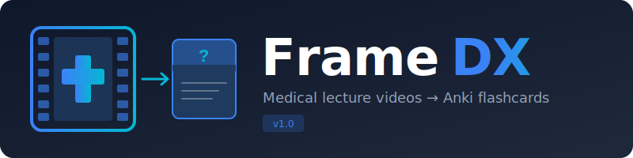

<p align="center">
  
</p>

<p align="center">
  <strong>Turn medical lecture videos into Anki flashcards — automatically.</strong>
</p>

<p align="center">
  
  
  
  
</p>

---

## What is FrameDX?

FrameDX is a desktop app that processes medical/radiology lecture videos and extracts **image + diagnosis pairs** for [Anki](https://apps.ankiweb.net/) flashcard creation.

It watches for slide changes in the video, transcribes the audio with timestamps, and pairs each visual with what the doctor said about it — outputting Anki-ready flashcards.

### The Problem

Medical students spend hours manually:
1. Pausing lecture videos on important slides
2. Taking screenshots
3. Typing what the professor said
4. Creating Anki cards one by one

**FrameDX automates all of this.**

## Use Cases

- **Radiology residents** — Extract imaging findings (X-rays, CTs, MRIs) paired with diagnoses from lecture recordings
- **Medical students** — Turn any recorded lecture into a study deck: pathology slides, anatomy diagrams, clinical images
- **Board exam prep** — Batch-process an entire lecture series into flashcards in one session
- **Transcript extraction** — Get `.txt` and `.srt` subtitle files from any video, with word-level timestamps
- **Slide extraction** — Pull all unique slides/images from a lecture into a clean numbered folder

## Features

| Feature | Description |
|---|---|
| **Automatic slide detection** | Uses SSIM (Structural Similarity Index) to detect when the presenter changes slides |
| **Speech transcription** | Powered by [faster-whisper](https://github.com/SYSTRAN/faster-whisper) with word-level timestamps |
| **Smart matching** | Pairs each detected slide with the transcript from the surrounding seconds |
| **Review before export** | Edit text, delete bad cards, click images to see full resolution — before exporting |
| **Anki export** | One-click `.apkg` export with images embedded, ready to import |
| **Transcript Only mode** | Export `.txt` + `.srt` files without slide detection |
| **Slides Only mode** | Extract slide images to a folder without transcription |
| **LLM medical term correction** | Optional Claude API integration to fix garbled medical terminology |
| **Dark mode** | Built-in dark theme for late-night study sessions |
| **Real-time processing log** | Timestamped log panel shows exactly what's happening |

## Requirements

- **Python** 3.10+
- **ffmpeg** — must be on your PATH ([download](https://www.gyan.dev/ffmpeg/builds/))
- ~3 GB RAM for the `large-v3` Whisper model (INT8 quantized)
- No GPU required — runs entirely on CPU via CTranslate2

## Installation

```bash
# Clone the repo
git clone https://github.com/Sn0wfly/FrameDx.git
cd FrameDx

# Install dependencies
pip install -r requirements.txt

# Run
python -m framedx.main
```

### Dependencies

```
PySide6>=6.6          # Qt6 GUI framework
opencv-python>=4.9    # Video frame extraction
scikit-image>=0.22    # SSIM slide change detection
faster-whisper>=1.1   # Speech-to-text (CPU optimized)
genanki>=0.13         # Anki deck generation
ffmpeg-python>=0.2    # Audio extraction
anthropic>=0.40       # Optional: Claude API for medical term correction
numpy
```

## Quick Start

1. Launch the app: `python -m framedx.main`
2. Click **Add Files** and select your lecture video(s)
3. Adjust settings if needed (defaults work well for most lectures)
4. Click **Start Processing (Anki)** and wait for it to finish
5. Review the extracted cards on the right panel — edit text, delete bad ones
6. Click **Export to Anki** to save the `.apkg` file
7. Import into Anki

### Recommended Settings

| Setting | Value | Notes |
|---|---|---|
| Whisper Model | `large-v3` | Best accuracy, ~3GB RAM |
| Compute Type | `int8` | Fastest on CPU |
| SSIM Threshold | `0.85` | Lower = more slides detected |
| Frame Interval | `2.0 sec` | Lower = more precise but slower |
| Language | Force your language | Auto-detect can misclassify similar languages |

## Project Structure

```
FrameDx/
├── framedx/
│   ├── main.py                  # Entry point
│   ├── config/
│   │   └── settings.py          # Persistent settings (JSON in AppData)
│   ├── core/
│   │   ├── transcriber.py       # faster-whisper wrapper
│   │   ├── frame_extractor.py   # OpenCV + SSIM slide detection
│   │   ├── matcher.py           # Timestamp matching (slides ↔ transcript)
│   │   ├── llm_corrector.py     # Optional Claude API term correction
│   │   ├── anki_exporter.py     # genanki .apkg generation
│   │   └── pipeline.py          # QThread-based pipeline orchestrator
│   └── gui/
│       ├── main_window.py       # Main application window
│       ├── queue_panel.py       # File queue management
│       ├── settings_panel.py    # Configuration options
│       ├── review_panel.py      # Card review with inline editing
│       └── styles.py            # Light + Dark themes
├── assets/
│   ├── logo.svg
│   └── icon.svg
├── requirements.txt
└── README.md
```

## How It Works

```
Video File
    │
    ├──→ ffmpeg ──→ Audio (WAV 16kHz)
    │                   │
    │                   └──→ faster-whisper ──→ Transcript with word timestamps
    │
    └──→ OpenCV ──→ Frames every 2s
                        │
                        └──→ SSIM comparison ──→ Slide change detection
                                                        │
                                                        └──→ Match slides ↔ transcript
                                                                     │
                                                                     └──→ Review ──→ Anki .apkg
```

## License

MIT

## Contributing

Issues and PRs welcome. This project was built for medical students, by someone who understands the pain of manual flashcard creation.
